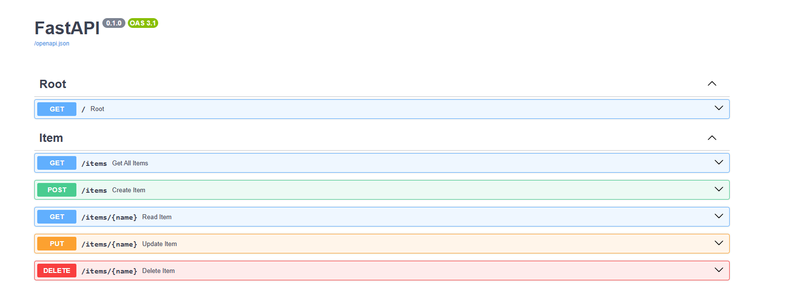

# FastAPI Starter

A minimal and ready-to-use [FastAPI](https://fastapi.tiangolo.com/) REST API template for rapid project setup.

[](https://railway.com/deploy/fastapi-1?referralCode=asepsp&utm_medium=integration&utm_source=template&utm_campaign=generic)



## ✨ Features

- FastAPI
- [Hypercorn](https://hypercorn.readthedocs.io/)
- Python 3

## 💁‍♀️ How to use

Clone this repository and install the required packages:
```bash
pip install -r requirements.txt
```
Run the server locally:
```bash
hypercorn main:app --reload
```

Open your browser and access:
- API: http://localhost:8000
- OpenAPI Documentation (Swagger UI): http://localhost:8000/docs
- Redoc Documentation: http://localhost:8000/redoc

## 📝 Notes

- To learn about how to use FastAPI with most of its features, you can visit the [FastAPI Documentation](https://fastapi.tiangolo.com/tutorial/)
- To learn about Hypercorn and how to configure it, read their [Documentation](https://hypercorn.readthedocs.io/)

